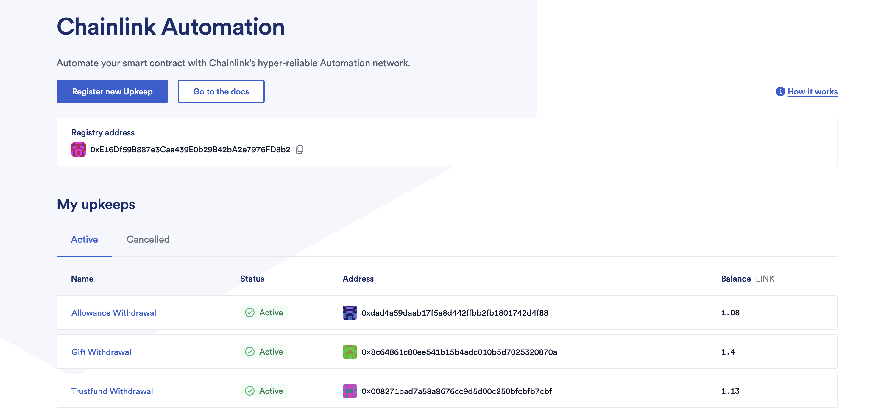

# ATIUM

#
## Description

This is a platform that enables users to save towards a goal, run an allowance for a ward or a trustfund plan for a ward in the future and easily gift their friends and family towards an event

#

#
> ## Tech Stack
|   <b><u>Stack</u></b>     |  <b><u>Usage</u></b>               |
| :-------------------------| :----------------------------------|
| **`Solidity`**            | Smart contract language            |
| **`React JS`**            | JavaScript library for UI          |
| **`Polygon`**             | Blockchain                         |
| **`Hardhat`**             | Ethereum devevelopment Environment |
| **`Alchemy`**             | Web3 development platform          |
| **`wagmi`**               | React hooks used for Atium         |
| **`Rainbow Toolkit`**     | Connect Wallet button              |
| **`OpenZeppelin`**        | Counters library                   |
| **`Chainlink`**           | Functions automation               |
 
#

### Use of the product

When a user connects to this platform, the user has the option of selecting a Savings Plan,
Allowance Plan, Trustfund Plan, or Gift Plan. These plans are chosen based on the user's interests.

 

 

- **Savings**  
The user can choose to save up to a goal in the savings plan, which can be an amount or a time limit.
Withdrawal is only possible after the goal has been met.

- **Allowance**  
The allowance plan is a plan created for guardians. In this case, the user can selcet the withdrawal amount and interval for the allowance. The bbenefit of this is that the guardian/sender does not have to constantly send allowance at every interval. All deposits could be made at the beginning, but only the selected amount can be withdrawn at every interval

- **Trustfund**  
The trustfund plan is for users that want to set up a trustfund for their wards. A startdate is inputted and the method of withdrawal interval is chosen. Withdrawl is automated by Chainlink

- **Gift**  
The Gift plan is made specifically to deposit an amount in anticipation of an event. The gift plan is
automated on the receiver's eventful day  

 

 

The Blockchain package contains custom smart contracts which deploy to Polygon. For this hackathon, it has been deployed on Polygon testnet - mumbai 

The package consists of a single repo: 

[https://github.com/galadd/Atium.git](https://github.com/galadd/Atium.git)

### Deployment

#### Atium.sol

- https://mumbai.polygonscan.com/address/0xEA5B4d81115aa221E38Ea1f8aAc8F39f46701A73#code

### Troubleshoot

1. If transaction returns error (JSON RPC ERROR)  
When metamask notification pops up for confirmation, wait for about 5 seconds or more before confirming the transaction.